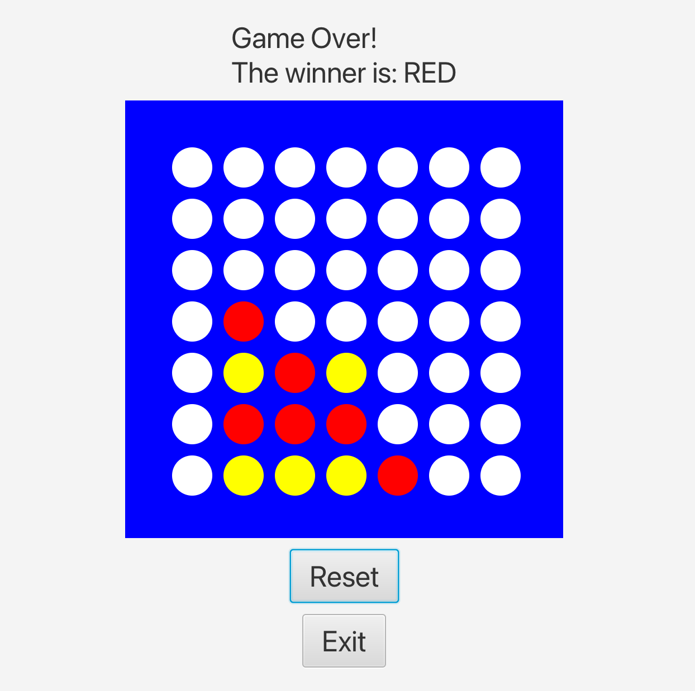

# devtools-23-ws

Eine JavaFx Implementierung des Klassikers "Vier Gewinnt" mit einem kleinen Twist.
Das Spielfeld kann um 90° im Uhrzeigersinn gedreht werden, wenn ein bestimmtes Muster erreicht wird.
Dabei handelt es sich um ein 2x2 Quadrat, das mit den Farben **eines** Spielers gefüllt sein muss.
Das Projekt wurde im Rahmen des Kurses "DevTools" im Studiengang Software Engineering Bachelor an der
Hochschule Heilbronn im Sommersemester 2023 entwickelt.

Unser Team hat nur den Code in den folgenden Pakten entwickelt, sowie alle sämtlichen Dateien/Änderungen, die
mit `ConnectFour` gekennzeichnet sind. Der restliche Code wurde von der Hochschule Heilbronn bereitgestellt.

- de.hhn.it.devtools.apis.connectfour
- de.hhn.it.devtools.components.connectfour.provider
- de.hhn.it.devtools.javafx.connectfour
- de.hhn.it.devtools.javafx.controllers.ConnectFourController

Um die Veröffentlichung von Personenbezogenen Daten zu vermeiden, wurde nur der Code und nicht die
git-Historie kopiert und veröffentlicht. Das Team besteht aus vier Personen und alle haben zu gleichen
Teilen an dem Projekt gearbeitet.

## Teammitglieder
- [Nils](https://github.com/nocheatoriginal)
- [Noah](https://github.com/mochiqt)
- Fabian
- Johannes

## Gradle Tasks

- `gradle run`: Startet die Anwendung.
- `gradle test`: Führt die Unit-Tests aus.
- `gradle jacocoTestReport`: Erstellt einen Testabdeckungsbericht.
